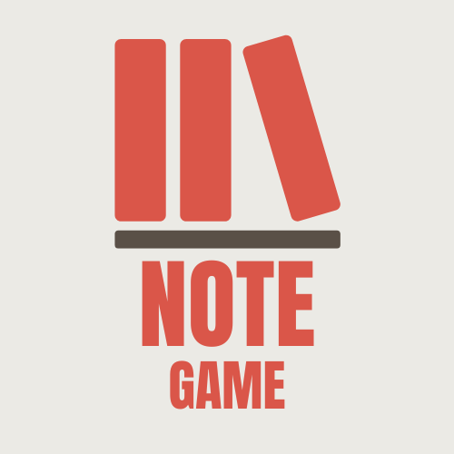

# NoteGame

  

  A stylish desktop application for gamers to take and organize notes about their favorite games.

## 📋 About

NoteGame is an Electron-based desktop application designed for gamers who want to keep track of their gaming experiences. Whether you need to remember quest locations, item combinations, character builds, or any other game-related information, NoteGame provides a clean, modern interface to organize your notes by game.

## 🌟 Features

- **Game Organization**: Create and manage multiple games in one place
- **Note Taking**: Write and save notes for each of your games
- **Modern UI**: Enjoy a sleek, dark-themed interface with glass-like effects
- **Data Persistence**: Your games and notes are automatically saved and will be there when you restart the app
- **Desktop Integration**: Runs as a native desktop app on Windows

## 🚀 Technologies Used

- **[Electron](https://www.electronjs.org/)**: Cross-platform desktop app framework
- **[React](https://reactjs.org/)**: UI library for building the interface
- **[TypeScript](https://www.typescriptlang.org/)**: Type-safe JavaScript
- **[Tailwind CSS](https://tailwindcss.com/)**: Utility-first CSS framework
- **[localStorage API](https://developer.mozilla.org/en-US/docs/Web/API/Window/localStorage)**: For data persistence
- **[Webpack](https://webpack.js.org/)**: Module bundler

## 💾 Installation

### Windows

You can download the installer from the GitHub Releases page:

- **[Download from GitHub Releases](https://github.com/GitHixy/NoteGame/releases)**: Get the latest installer
- **[Release Information](releases/)**: View additional release information

Once downloaded, simply run the installer and follow the on-screen instructions to install NoteGame on your Windows system.

## 📝 Usage

1. Launch the NoteGame application
2. Click "Add" in the Games panel to create a new game
3. Select a game and add notes by clicking "Add" in the Notes panel
4. Edit or delete games and notes as needed
5. Your data is automatically saved

## 📄 License

This project is licensed under the ISC License.

## 🤝 Contributing

Contributions, issues, and feature requests are welcome!

---

  Made with ❤️ by GitHixy

